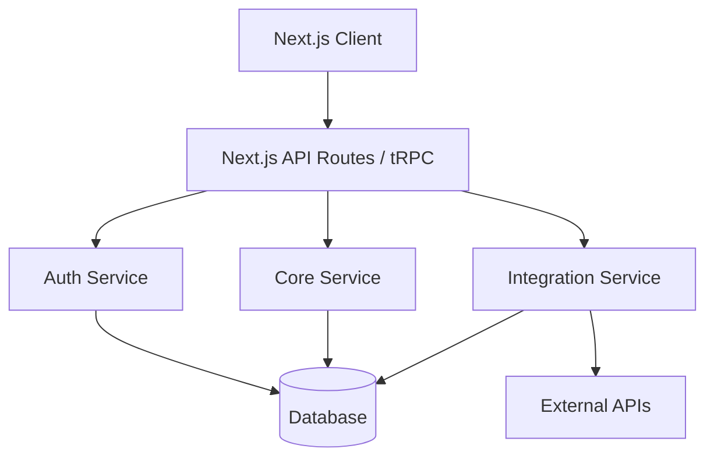
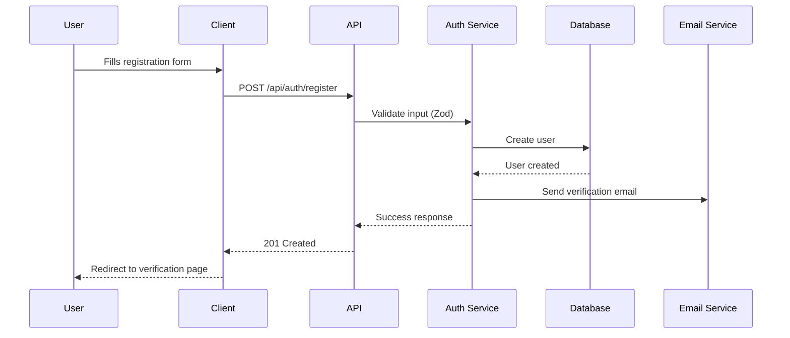
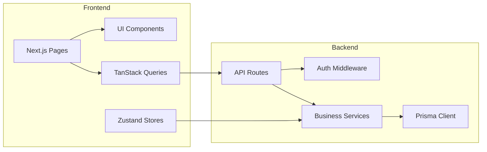

# 20-ARCHITECTURE.md — High-Level Architecture

## Purpose
Define the system architecture, module breakdown, folder structure, and key architectural decisions.

## Input
- `docs/PRD.md` (from 13-PRD)
- `docs/requirements.md` (from 14-REQUIREMENTS)

## Process

1. Review requirements and identify system boundaries.
2. Design high-level architecture with modules.
3. Define folder structure for frontend and backend.
4. Document sequence diagrams for key flows.
5. Document component/module relationships.

## Output

```
docs/architecture/
├── high-level-architecture.md
├── modules.md
├── folder-structure.md
├── sequence-diagrams.md
└── component-diagram.md
```

## Templates

### High-Level Architecture

```markdown
# High-Level Architecture

## Architecture Style
<!-- e.g. Monolithic (Next.js fullstack), Microservices, BFF -->

## Diagram



## Key Decisions
- **Why Next.js fullstack:** Rapid development, shared types, single deployment
- **Why tRPC:** End-to-end type safety, reduced boilerplate
- **Why Prisma:** Type-safe queries, migrations, great DX
```

### Modules

```markdown
# Modules

## Module: Authentication
- **Responsibility:** User registration, login, session management
- **Key Files:** `src/app/api/auth/`, `src/lib/auth.ts`
- **Dependencies:** Database, Email Service

## Module: [Name]
...
```

### Folder Structure

```markdown
# Folder Structure

```
project-root/
├── .github/workflows/        # CI/CD pipelines
├── .ai/                      # AI framework files (not deployed)
├── docs/                     # Documentation (not deployed)
├── public/                   # Static assets
├── src/
│   ├── app/                  # Next.js App Router pages
│   │   ├── (auth)/           # Auth-related routes
│   │   ├── (dashboard)/      # Dashboard routes
│   │   └── api/              # API routes
│   ├── components/           # Shared components
│   │   ├── ui/               # UI primitives (shadcn)
│   │   └── features/         # Feature-specific components
│   ├── lib/                  # Shared utilities
│   │   ├── db.ts             # Database client
│   │   ├── auth.ts           # Auth configuration
│   │   └── validations/      # Zod schemas
│   ├── server/               # Server-side logic
│   │   ├── actions/          # Server actions
│   │   └── services/         # Business logic
│   ├── store/                # Zustand stores
│   └── types/                # Shared TypeScript types
├── prisma/                   # Prisma schema & migrations
├── docker-compose.yml
├── Dockerfile
├── next.config.ts
├── tailwind.config.ts
├── tsconfig.json
└── package.json
```

```

### Sequence Diagrams

```markdown
# Sequence Diagrams

## User Registration Flow



## [Other Flows]
...
```

### Component Diagram

```markdown
# Component Diagram



```

## Checklist

- [ ] Architecture style is chosen and justified
- [ ] All modules are identified with responsibilities
- [ ] Folder structure is defined for the entire project
- [ ] Key sequence diagrams cover critical flows
- [ ] Component relationships are documented
- [ ] Architecture decisions are documented with rationale
- [ ] All files saved to `docs/architecture/`
