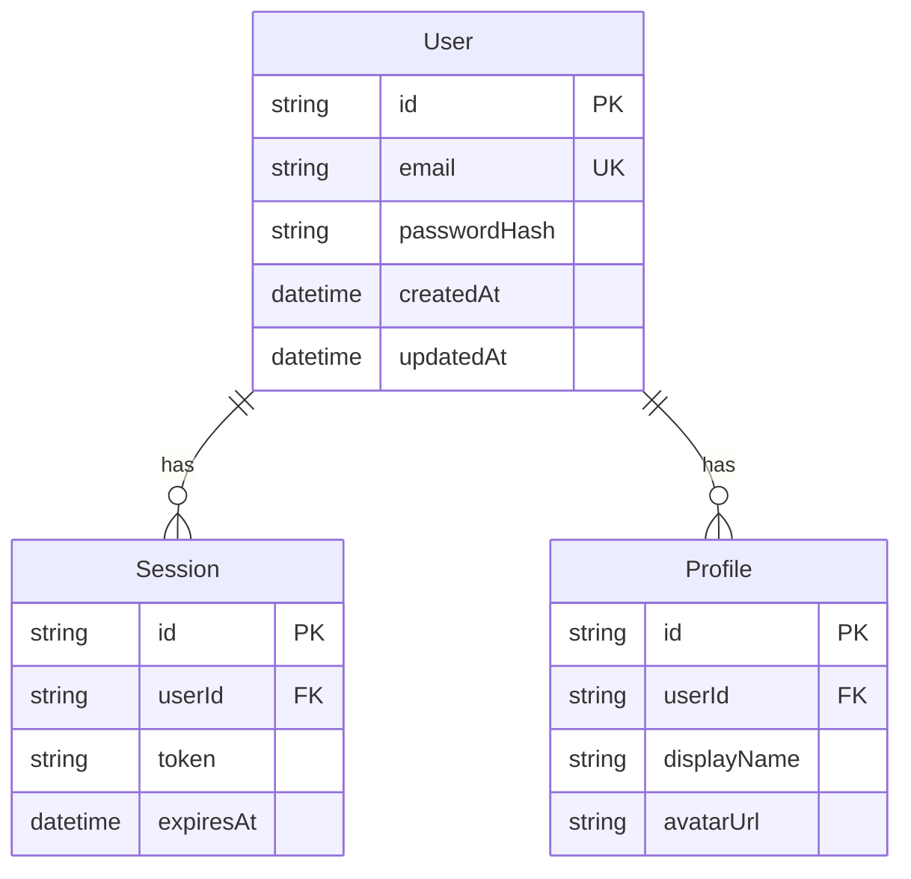

# 21-ERD.md — Entity Relationship Diagram

## Purpose
Design the data model: entities, relationships, and cardinality.

## Input
- `docs/requirements.md` (from 14-REQUIREMENTS)
- `docs/architecture/modules.md` (from 20-ARCHITECTURE)

## Process

1. Review requirements to identify entities.
2. Define entity attributes (fields, types, constraints).
3. Establish relationships between entities.
4. Document cardinality (one-to-one, one-to-many, many-to-many).

## Output

```
docs/architecture/erd.md
```

## Template

```markdown
# Entity Relationship Diagram

## Entities Overview



## Entity Definitions

| Entity | Description | Key Fields |
|--------|-------------|------------|
| User | Registered user account | id, email, passwordHash |
| Profile | User profile information | id, userId, displayName |
| Session | User session/token | id, userId, token, expiresAt |

## Relationships

| From | To | Type | Description |
|------|----|------|-------------|
| User | Profile | One-to-One | Each user has one profile |
| User | Session | One-to-Many | Each user can have many sessions |

## Cardinality Notes

- **One-to-One (1:1):** User to Profile
- **One-to-Many (1:N):** User to Session
- **Many-to-Many (M:N):** Use junction tables
