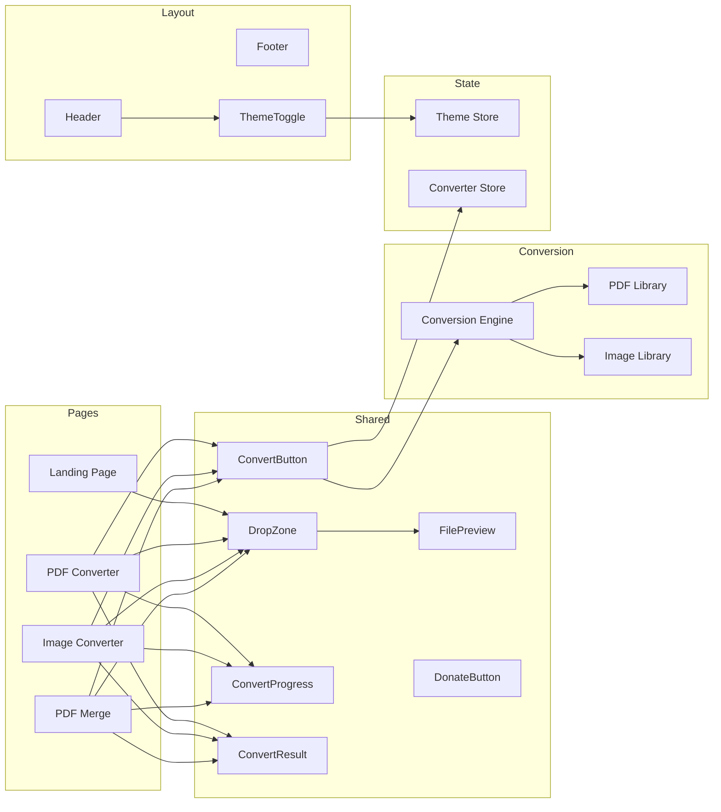
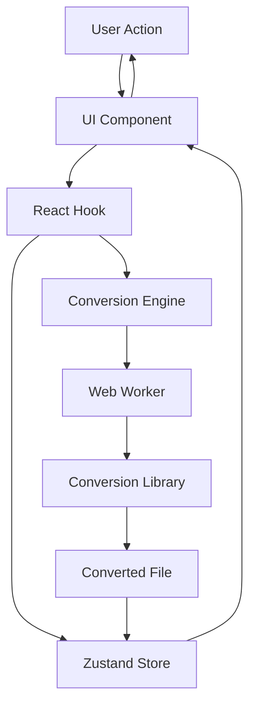

# Component Diagram

## Component Hierarchy



---

## Component Details

### Layout Components

#### Header
- **Props:** None
- **Renders:** Logo, Navigation, ThemeToggle
- **Behavior:** Sticky top, responsive (hamburger menu on mobile)

#### Footer
- **Props:** None
- **Renders:** Copyright, Links, DonateButton
- **Behavior:** Static bottom

#### ThemeToggle
- **Props:** None
- **Renders:** Sun/Moon icon button
- **Behavior:** Toggle dark/light mode, save to localStorage

---

### Upload Components

#### DropZone
- **Props:** `onFileSelect: (file: File) => void`, `accept?: string[]`
- **Renders:** Drag & drop area with visual feedback
- **Behavior:** 
  - Handle drag events (dragenter, dragleave, drop)
  - Validate file on drop
  - Call onFileSelect with validated file
  - Show error toast for invalid files

#### FileInput
- **Props:** `onFileSelect: (file: File) => void`, `accept?: string[]`
- **Renders:** Hidden file input with styled button
- **Behavior:**
  - Trigger file input click
  - Handle file selection
  - Validate file
  - Call onFileSelect

#### FilePreview
- **Props:** `file: File`, `type: 'pdf' | 'image'`
- **Renders:** Preview of uploaded file
- **Behavior:**
  - PDF: Show first page thumbnail
  - Image: Show image preview
  - Show file metadata (name, size, type)

---

### Conversion Components

#### ConvertButton
- **Props:** `onClick: () => void`, `disabled?: boolean`, `loading?: boolean`
- **Renders:** Primary action button
- **Behavior:**
  - Show loading state during conversion
  - Disable during conversion
  - Trigger conversion on click

#### ConvertProgress
- **Props:** `progress: number`, `status: string`
- **Renders:** Progress bar with status text
- **Behavior:**
  - Show animated progress bar
  - Display current status (Loading, Converting, Done)
  - Show percentage

#### ConvertResult
- **Props:** `result: Blob | string`, `filename: string`, `format: string`
- **Renders:** Result preview + download button
- **Behavior:**
  - Show text result or image preview
  - Provide download button
  - Provide copy to clipboard button (for text)

---

### State Management

#### Theme Store (Zustand)
```typescript
interface ThemeStore {
  theme: 'light' | 'dark' | 'system'
  setTheme: (theme: 'light' | 'dark' | 'system') => void
}
```

#### Converter Store (Zustand)
```typescript
interface ConverterStore {
  file: File | null
  result: Blob | string | null
  progress: number
  status: 'idle' | 'loading' | 'converting' | 'done' | 'error'
  error: string | null
  setFile: (file: File) => void
  convert: (options: ConvertOptions) => Promise<void>
  reset: () => void
}
```

---

## Data Flow Diagram


