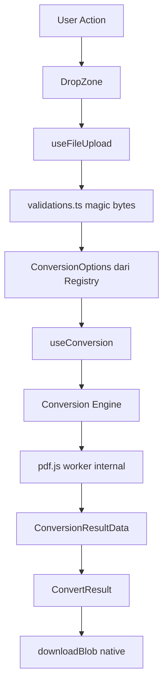

# Component Diagram

> Aktual per Sprint 2.5 (19 Juli 2026).

## Component Hierarchy

```mermaid
graph LR
    subgraph Layout
        Header
        Footer
        ThemeToggle
        Container
    end

    subgraph Pages
        Landing[Landing Page]
        Konversi[/konversi]
        PDF[/pdf]
        Image[/image]
        Merge[/merge]
    end

    subgraph ConverterFlow[Universal Converter Flow]
        UniversalConverter
        ConversionOptions
        ConvertProgress
        ConvertResult
    end

    subgraph Upload
        DropZone
        FilePreview
    end

    subgraph Conversion
        Registry[Conversion Registry]
        Engine[Conversion Engine]
        PDFLib[pdf.js lazy]
    end

    Konversi --> UniversalConverter
    PDF --> UniversalConverter
    Image --> UniversalConverter
    Merge --> UniversalConverter

    UniversalConverter --> DropZone
    UniversalConverter --> FilePreview
    UniversalConverter --> ConversionOptions
    UniversalConverter --> ConvertProgress
    UniversalConverter --> ConvertResult

    ConversionOptions --> Registry
    UniversalConverter --> Engine
    Engine --> PDFLib
```

---

## Component Details

### Layout Components

#### Header
- **Props:** None
- **Renders:** Logo, Navigation (dari `siteConfig.nav`), ThemeToggle, CTA, mobile Sheet menu
- **Behavior:** Sticky top, backdrop blur, hamburger menu di mobile

#### Footer
- **Props:** None
- **Renders:** Logo, nav links, tombol donasi Saweria, copyright
- **Behavior:** Static bottom

#### ThemeToggle
- **Props:** None
- **Renders:** Sun/Moon icon (CSS `dark:` variant — tanpa JS state)
- **Behavior:** Toggle dark/light via next-themes

#### Container
- **Props:** `className?`, children
- **Renders:** Max-width wrapper (max-w-6xl, responsive padding)

---

### Upload Components

#### DropZone
- **Props:** `onFilesSelected: (files: File[]) => void`, `accept: string`, `multiple?`, `disabled?`, `title?`, `description?`
- **Renders:** Drag & drop area dengan visual feedback
- **Behavior:**
  - Handle drag events (dragover highlight, drop)
  - Click-to-browse via hidden input
  - Keyboard accessible (role button, Enter/Space)
  - Validasi dilakukan oleh pemanggil (`useFileUpload`), bukan di dalam DropZone

#### FilePreview
- **Props:** `file: File`, `fileType: SupportedFileType`, `thumbnail?: string | null`, `onRemove: () => void`
- **Renders:** Preview card (thumbnail/icon + nama + ukuran + tipe)
- **Behavior:**
  - PDF: thumbnail dari `renderPdfThumbnail` (via prop)
  - Image: object URL via `useMemo` + revoke di cleanup effect
  - Loading state: skeleton pulse saat `thumbnail === undefined`

---

### Universal Converter Components

#### UniversalConverter
- **Props:** `allowedTypes: SupportedFileType[]`, `accept: string`, `dropzoneDescription?`
- **Renders:** DropZone → FilePreview + ConversionOptions → ConvertProgress → ConvertResult
- **Behavior:**
  - Orchestrator utama, dipakai `/konversi`, `/pdf`, `/image`, `/merge`
  - Opsi `requiresMultiple` redirect ke `/merge`
  - Thumbnail PDF di-generate async setelah upload

#### ConversionOptions
- **Props:** `fileType: SupportedFileType`, `onSelect: (option: ConversionOption) => void`
- **Renders:** Grid kartu "Bisa dikonversi ke:" dari `CONVERSION_REGISTRY`
- **Behavior:**
  - Opsi `implemented: false` → disabled + badge "Segera"
  - Opsi aktif → hover effect + arrow indicator

#### ConvertProgress
- **Props:** `progress: number`, `statusText?: string`
- **Renders:** Progress bar + persentase + spinner
- **Behavior:** `aria-live="polite"` untuk screen reader

#### ConvertResult
- **Props:** `result: ConversionResultData`, `onReset: () => void`
- **Renders:** Info file hasil + tombol Download/Copy + preview teks
- **Behavior:**
  - Download via `downloadBlob` (native `<a download>`)
  - Copy to clipboard dengan feedback "Tersalin"
  - "Konversi file lain" → reset flow

---

### Hooks & State

State dikelola via **React hooks lokal** (bukan Zustand untuk saat ini):

#### useFileUpload(allowedTypes)
```typescript
{
  file: File | null
  fileType: SupportedFileType | null
  selectFile: (file: File) => Promise<SupportedFileType | false>
  reset: () => void
}
```

#### useConversion()
```typescript
{
  status: 'idle' | 'converting' | 'done' | 'error'
  progress: number
  result: ConversionResultData | null
  error: string | null
  convert: (file: File, type: ConversionType) => Promise<void>
  reset: () => void
}
```

#### Theme
Dikelola **next-themes** (bukan Zustand) — persist otomatis ke localStorage.

---

## Data Flow Diagram


