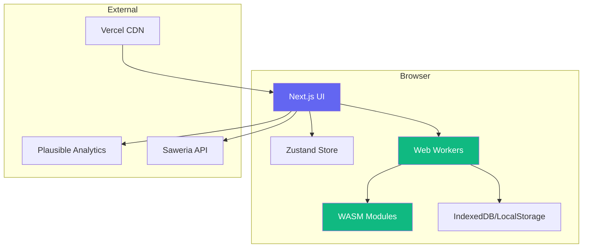
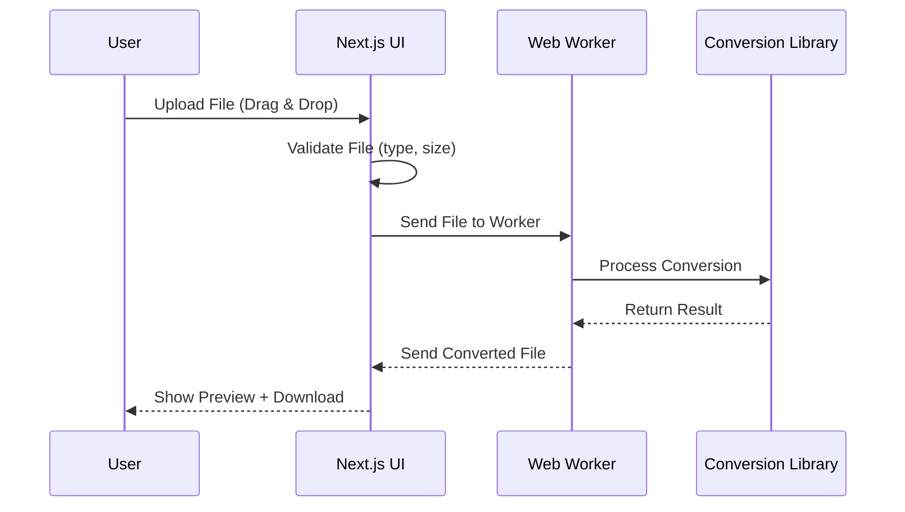

# High-Level Architecture

## Architecture Style
**Static SPA with Client-Side Processing**

Gantiin adalah Next.js application yang di-deploy sebagai static site. Semua processing file dilakukan di browser menggunakan Web APIs (File API, Web Workers, WASM). Tidak ada server-side processing atau database.

## Diagram

## Key Decisions

### Why Next.js (Static Export)
- **SEO:** Static generation untuk landing page yang optimal
- **Performance:** Static export untuk fast load
- **Developer Experience:** Hot reload, TypeScript, great DX
- **Deployment:** Zero-config deploy ke Vercel

### Why Client-Side Processing
- **Privacy:** File tidak pernah meninggalkan browser
- **Cost:** Zero server cost (100% free hosting)
- **Scalability:** Tidak ada server bottleneck
- **Offline:** Bisa bekerja tanpa internet (setelah initial load)

### Why Web Workers
- **Performance:** Tidak memblokir UI thread
- **UX:** Progress bar bisa update selama konversi
- **Memory:** isolate memory per worker

### Why WASM
- **Performance:** 10-100x lebih cepat dari JavaScript untuk processing
- **Library Support:** Banyak libraries konversi tersedia dalam WASM
- **Compatibility:** Support di semua browser modern

## Data Flow

## Technology Stack

| Layer | Technology | Purpose |
|-------|------------|---------|
| **UI Framework** | Next.js 16 (App Router) | React framework, static export |
| **Language** | TypeScript | Type safety |
| **Styling** | Tailwind CSS v4 | Utility-first CSS |
| **Components** | Shadcn/ui | UI component library |
| **State** | Zustand | Global state management |
| **Validation** | Zod | Schema validation |
| **PDF Extract** | pdfjs-dist 6.x | Text extraction & rendering (lazy) |
| **PDF Manipulation** | @cantoo/pdf-lib | Merge, split, create PDF (lazy) |
| **HEIC** | heic-to | HEIC→JPG decoder WASM (lazy) |
| **Image** | Canvas API + @jsquash/webp | Conversion & compression |
| **Download** | Native `<a download>` | File download |
| **Analytics** | Umami (self-hosted) | Privacy-friendly analytics |
| **Hosting** | Vercel | Static hosting |
| **Domain** | Custom (.com/.id) | Brand identity |
