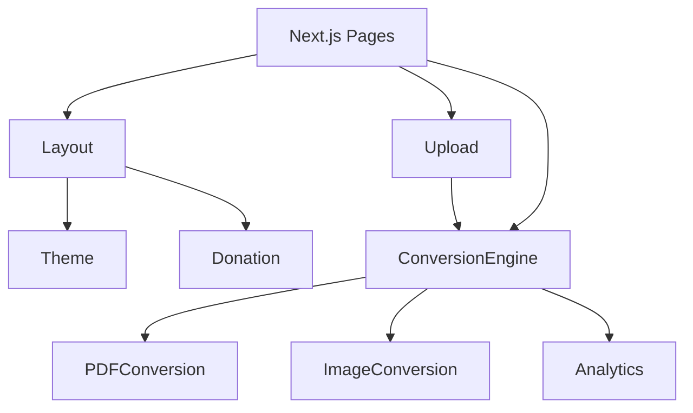

# Modules

## Module: File Upload

- **Responsibility:** Handle file upload via drag & drop atau click, validasi file type dan size
- **Key Files:** `src/components/upload/`
- **Dependencies:** None

### Components
| Component | Purpose |
|-----------|---------|
| `DropZone.tsx` | Main drag & drop area |
| `FileInput.tsx` | Click-to-browse fallback |
| `FilePreview.tsx` | Preview uploaded file |
| `FileValidator.ts` | Validate file type & size |

---

## Module: PDF Conversion

- **Responsibility:** Convert PDF ke text, merge, split
- **Key Files:** `src/lib/conversions/pdf.ts`
- **Dependencies:** pdf.js, pdf-lib

### Functions
| Function | Purpose |
|----------|---------|
| `pdfToText(file)` | Extract text from PDF |
| `mergePDFs(files)` | Merge multiple PDFs |
| `splitPDF(file, pages)` | Extract specific pages |

---

## Module: Image Conversion

- **Responsibility:** Convert image formats, resize, compress
- **Key Files:** `src/lib/conversions/image.ts`
- **Dependencies:** browser-image-compression

### Functions
| Function | Purpose |
|----------|---------|
| `convertImage(file, format, quality)` | Convert to target format |
| `resizeImage(file, width, height)` | Resize dimensions |
| `compressImage(file, quality)` | Reduce file size |

---

## Module: Conversion Engine

- **Responsibility:** Orchestrate conversion process, manage Web Workers
- **Key Files:** `src/lib/conversions/engine.ts`
- **Dependencies:** PDF Module, Image Module

### Functions
| Function | Purpose |
|----------|---------|
| `convertFile(file, options)` | Main conversion entry point |
| `getSupportedFormats()` | List supported conversions |
| `estimateConversionTime(file)` | Estimate processing time |

---

## Module: Theme

- **Responsibility:** Dark/Light mode management
- **Key Files:** `src/components/layout/ThemeToggle.tsx`, `src/store/theme.ts`
- **Dependencies:** None

### Components
| Component | Purpose |
|-----------|---------|
| `ThemeToggle.tsx` | Toggle button |
| `ThemeProvider.tsx` | Context provider |

---

## Module: Donation

- **Responsibility:** Donation button and link
- **Key Files:** `src/components/donation/`
- **Dependencies:** None

### Components
| Component | Purpose |
|-----------|---------|
| `DonateButton.tsx` | Donation CTA button |
| `DonateModal.tsx` | Info about donation |

---

## Module: Analytics

- **Responsibility:** Track user events (privacy-friendly)
- **Key Files:** `src/lib/analytics.ts`
- **Dependencies:** Plausible

### Functions
| Function | Purpose |
|----------|---------|
| `trackEvent(name, props)` | Track custom event |
| `trackConversion(type, duration)` | Track conversion event |
| `trackError(type, message)` | Track error event |

---

## Module: Layout

- **Responsibility:** Page layout, header, footer
- **Key Files:** `src/components/layout/`
- **Dependencies:** Theme Module

### Components
| Component | Purpose |
|-----------|---------|
| `Header.tsx` | Top navigation |
| `Footer.tsx` | Bottom footer |
| `Container.tsx` | Content container |

---

## Module Relationship Diagram

