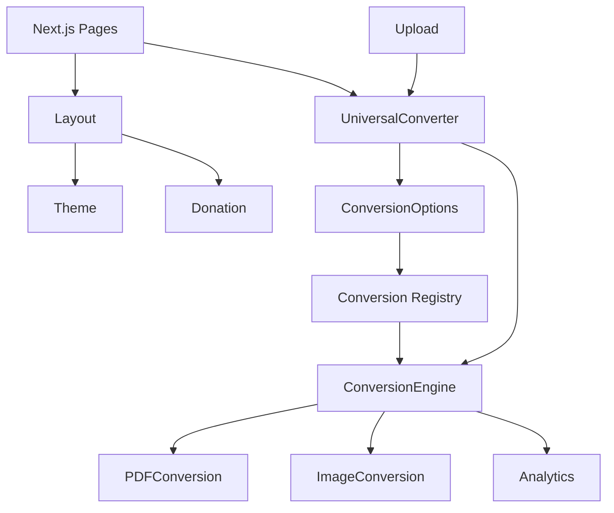

# Modules

## Module: File Upload

- **Responsibility:** Handle file upload via drag & drop atau click, validasi file type dan size
- **Key Files:** `src/components/upload/`, `src/lib/validations.ts`, `src/hooks/useFileUpload.ts`
- **Dependencies:** None

### Components
| Component | Purpose |
|-----------|---------|
| `DropZone.tsx` | Drag & drop area + click-to-browse + keyboard accessible |
| `FilePreview.tsx` | Preview uploaded file (PDF thumbnail / image object URL) |
| `validations.ts` | Magic bytes detection (`detectFileType`), size validation, `formatFileSize` |
| `useFileUpload.ts` | Hook: file selection + validasi via toast |

---

## Module: PDF Conversion

- **Responsibility:** Convert PDF ke text, thumbnail, merge, split
- **Key Files:** `src/lib/conversions/pdf.ts`
- **Dependencies:** pdfjs-dist 6 (lazy-loaded), @cantoo/pdf-lib (Sprint 4)

### Functions
| Function | Purpose |
|----------|---------|
| `extractTextFromPdf(file, onProgress)` | Extract text dari semua halaman |
| `renderPdfThumbnail(file, maxWidth)` | Render halaman pertama sebagai data URL |
| `mergePDFs(files)` | Merge multiple PDFs — Sprint 4 |
| `splitPDF(file, pages)` | Extract specific pages — Sprint 4 |

**Catatan:** pdf.js memakai worker internal sendiri (`pdf.worker.min.mjs` via `new URL(import.meta.url)`). Standard fonts di-copy ke `public/pdfjs/` oleh postinstall script. Cleanup via `loadingTask.destroy()`.

---

## Module: Image Conversion (Sprint 3)

- **Responsibility:** Convert image formats, resize, compress
- **Key Files:** `src/lib/conversions/image.ts` (belum dibuat)
- **Dependencies:** Canvas API native, @jsquash/webp (fallback Safari), heic-to (HEIC)

### Functions
| Function | Purpose |
|----------|---------|
| `convertImage(file, format, quality)` | Convert to target format |
| `resizeImage(file, width, height)` | Resize dimensions |
| `compressImage(file, quality)` | Reduce file size |

---

## Module: Conversion Engine

- **Responsibility:** Orchestrate conversion process, routing ke converter yang sesuai
- **Key Files:** `src/lib/conversions/engine.ts`, `src/lib/conversions/registry.ts`
- **Dependencies:** PDF Module, Image Module

### Functions
| Function | Purpose |
|----------|---------|
| `convertFile(file, type, onProgress)` | Main conversion entry point (routing by ConversionType) |
| `CONVERSION_REGISTRY` | Source of truth: tipe file → opsi konversi (id, title, icon, implemented) |
| `getConversionOptions(fileType)` | Ambil daftar opsi untuk tipe file |

**Pola:** Menambah konversi baru = tambah entri di registry + implementasi di engine + set `implemented: true`.

### UI Orchestration
| Component | Purpose |
|-----------|---------|
| `UniversalConverter.tsx` | Flow: upload → deteksi → pilih opsi → konversi → hasil |
| `ConversionOptions.tsx` | Grid "Bisa dikonversi ke:" (badge "Segera" untuk yang belum aktif) |

---

## Module: Theme

- **Responsibility:** Dark/Light mode management
- **Key Files:** `src/components/theme-provider.tsx`, `src/components/layout/ThemeToggle.tsx`
- **Dependencies:** next-themes

### Components
| Component | Purpose |
|-----------|---------|
| `theme-provider.tsx` | Wrapper next-themes (attribute class, default system) |
| `ThemeToggle.tsx` | Toggle button Sun/Moon (CSS-based, tanpa setState di effect) |

**Catatan:** Tidak memakai Zustand store — state theme dikelola next-themes + localStorage otomatis.

---

## Module: Donation

- **Responsibility:** Donation button and link
- **Key Files:** `src/components/layout/Footer.tsx` (tombol "Dukung Gantiin" → Saweria)
- **Dependencies:** Saweria (eksternal)

### Components
| Component | Purpose |
|-----------|---------|
| Donate button (di Footer) | Link ke Saweria, target _blank |
| `DonateModal.tsx` | Info tentang donasi — Sprint 4 |

---

## Module: Analytics (Sprint 4)

- **Responsibility:** Track user events (privacy-friendly)
- **Key Files:** `src/lib/analytics.ts` (belum dibuat)
- **Dependencies:** Umami self-hosted (umami.alltech.web.id)

### Functions
| Function | Purpose |
|----------|---------|
| `trackEvent(name, props)` | Track custom event |
| `trackConversion(type, duration)` | Track conversion event |
| `trackError(type, message)` | Track error event |

---

## Module: Layout

- **Responsibility:** Page layout, header, footer
- **Key Files:** `src/components/layout/`
- **Dependencies:** Theme Module

### Components
| Component | Purpose |
|-----------|---------|
| `Header.tsx` | Top navigation |
| `Footer.tsx` | Bottom footer |
| `Container.tsx` | Content container |

---

## Module Relationship Diagram

