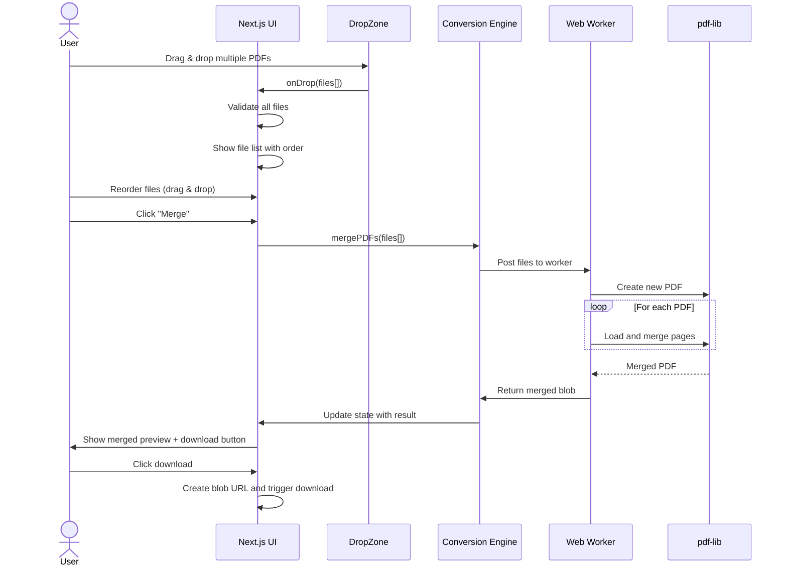
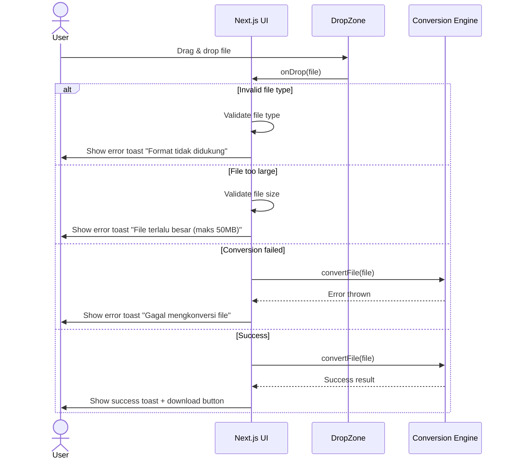
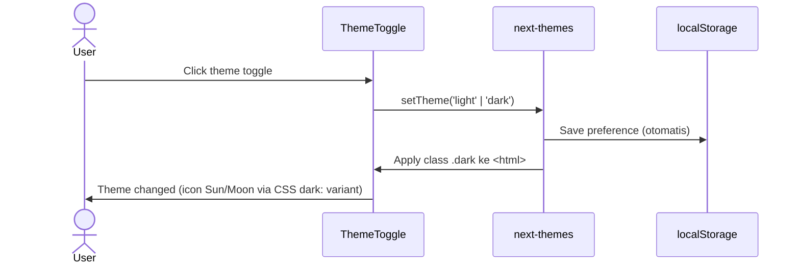
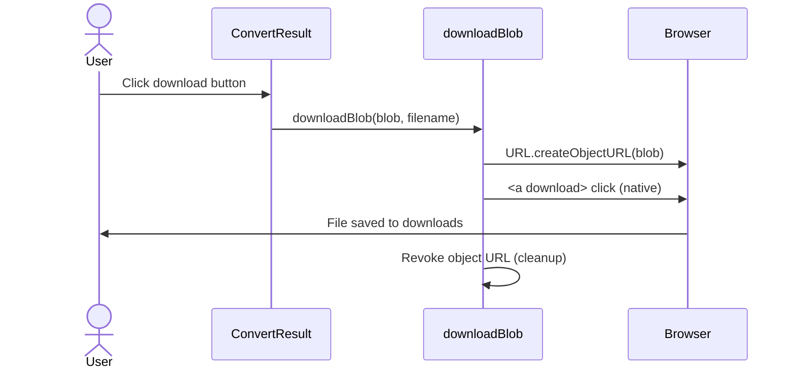

# Sequence Diagrams

## User Registration Flow
*Tidak ada user registration — Gantiin tidak memerlukan akun.*

---

## PDF to Text Conversion Flow

```mermaid
sequenceDiagram
    actor User
    participant UI as UniversalConverter
    participant Drop as DropZone
    participant Opt as ConversionOptions
    participant Conv as Conversion Engine
    participant Lib as pdf.js (worker internal)

    User->>Drop: Drag & drop PDF file
    Drop->>UI: onFilesSelected([file])
    UI->>UI: validateFile (magic bytes + size)
    UI->>Lib: renderPdfThumbnail (async, lazy-load)
    Lib-->>UI: Thumbnail halaman 1
    UI->>Opt: Tampilkan opsi "Bisa dikonversi ke:"
    User->>Opt: Pilih "PDF ke Teks"
    Opt->>UI: onSelect(option)
    UI->>Conv: convertFile(file, 'pdf-to-text', onProgress)
    Conv->>Lib: getDocument + extract text per halaman
    Lib-->>Conv: Text content + progress %
    Conv-->>UI: ConversionResultData (blob .txt)
    UI->>User: Show text preview + download button
    User->>UI: Click download
    UI->>UI: downloadBlob (native <a download>)
```

---

## Image Format Conversion Flow (Sprint 3)

```mermaid
sequenceDiagram
    actor User
    participant UI as UniversalConverter
    participant Drop as DropZone
    participant Opt as ConversionOptions
    participant Conv as Conversion Engine
    participant Canvas as Canvas API

    User->>Drop: Drag & drop image file
    Drop->>UI: onFilesSelected([file])
    UI->>UI: validateFile (magic bytes + size)
    UI->>UI: Show image preview (object URL)
    UI->>Opt: Tampilkan opsi "Bisa dikonversi ke:"
    User->>Opt: Pilih "Ganti Format"
    User->>UI: Select target format (JPG/PNG/WebP)
    User->>UI: Adjust quality (optional)
    UI->>Conv: convertFile(file, 'image-convert', options)
    Conv->>Canvas: createImageBitmap + draw + toBlob
    Canvas-->>Conv: Converted image blob
    Conv-->>UI: ConversionResultData
    UI->>User: Show converted preview + download button
    User->>UI: Click download
    UI->>UI: downloadBlob (native <a download>)
```

---

## PDF Merge Flow



---

## Error Handling Flow



---

## Theme Toggle Flow



---

## Download Flow


