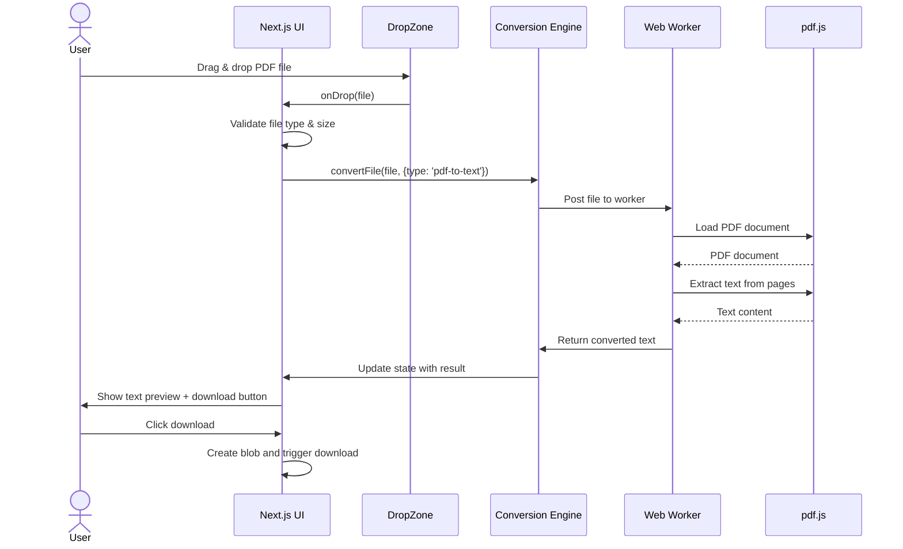
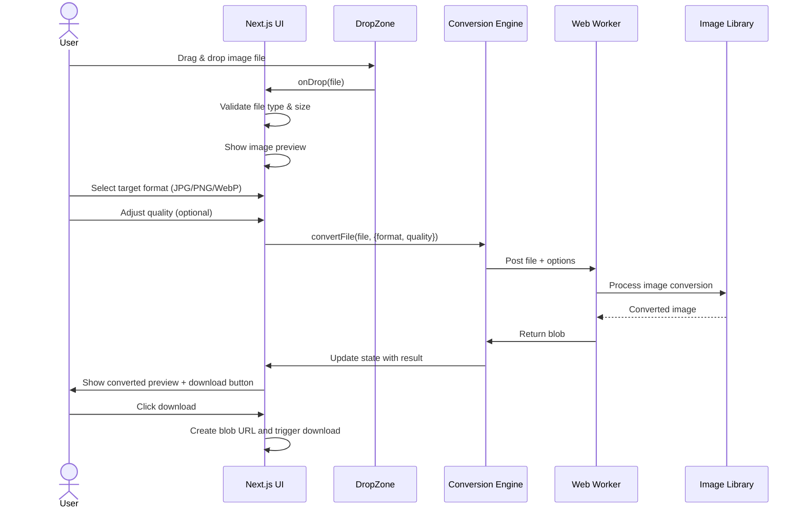
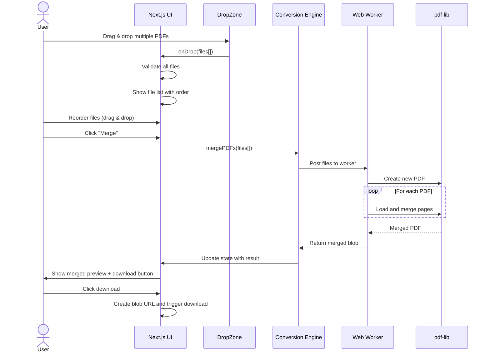
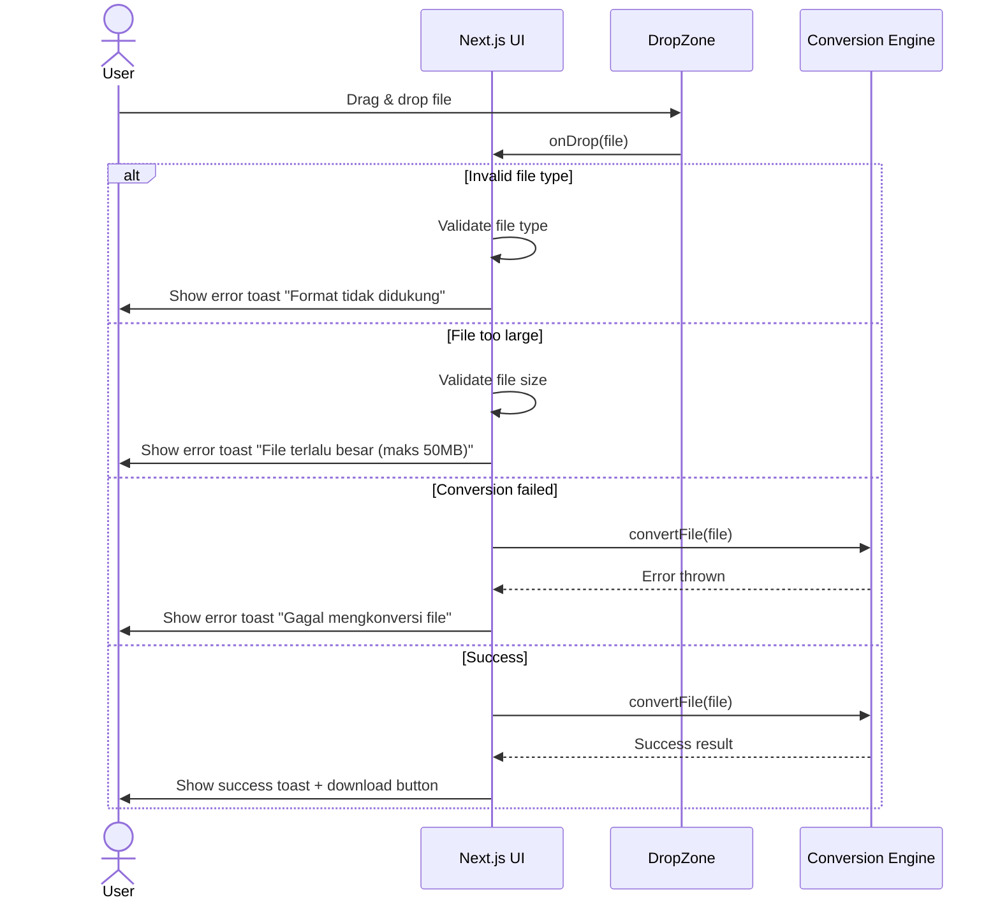
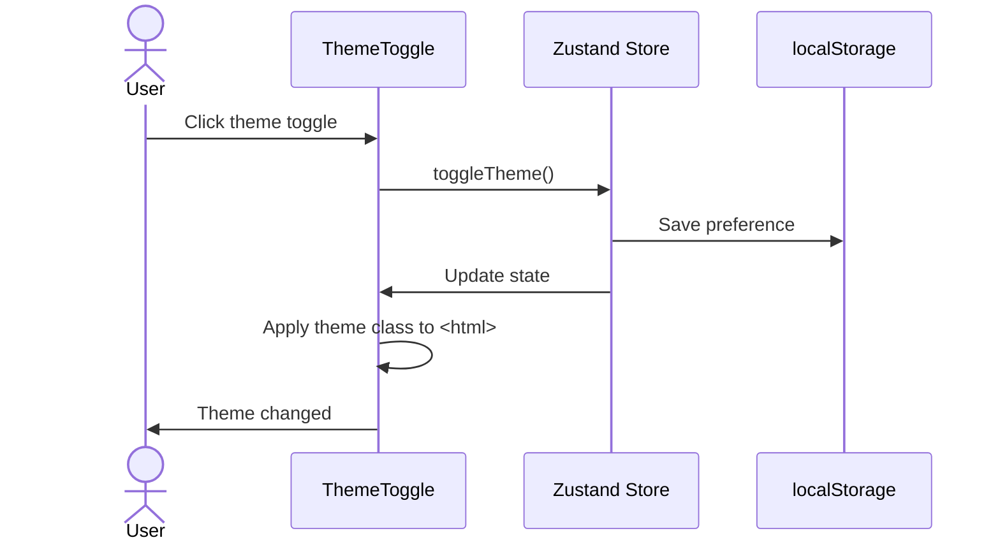
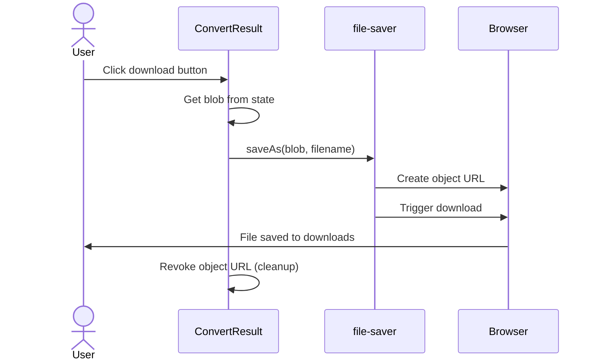

# Sequence Diagrams

## User Registration Flow
*Tidak ada user registration — Gantiin tidak memerlukan akun.*

---

## PDF to Text Conversion Flow

---

## Image Format Conversion Flow

---

## PDF Merge Flow

---

## Error Handling Flow

---

## Theme Toggle Flow

---

## Download Flow

